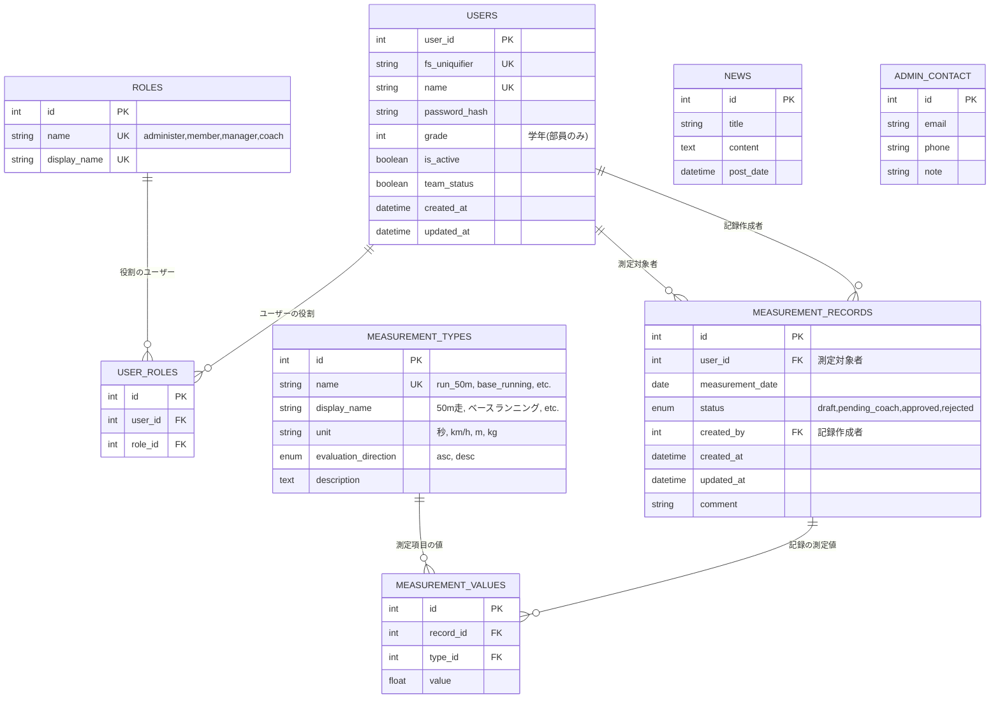

```mermaid
erDiagram
    %% ロール管理
    ROLES {
        int id PK
        string name UK "administer,member,manager,coach"
        string display_name UK
    }

    %% ユーザーロールの中間テーブル
    USER_ROLES {
        int id PK
        int user_id FK
        int role_id FK
    }

    %% ユーザー管理
    USERS {
        int user_id PK
        string fs_uniquifier UK
        string name UK
        string password_hash
        int grade "学年(部員のみ)"
        boolean is_active
        boolean team_status
        datetime created_at
        datetime updated_at
    }

    %% 測定項目管理
    MEASUREMENT_TYPES {
        int id PK
        string name UK "run_50m, base_running, etc."
        string display_name "50m走, ベースランニング, etc."
        string unit "秒, km/h, m, kg"
        enum evaluation_direction "asc, desc"
        text description
    }

    %% 測定記録
    MEASUREMENT_RECORDS {
        int id PK
        int user_id FK "測定対象者"
        date measurement_date
        enum status "draft,pending_coach,approved,rejected"
        int created_by FK "記録作成者"
        datetime created_at
        datetime updated_at
        string comment
    }

    %% 測定値
    MEASUREMENT_VALUES {
        int id PK
        int record_id FK
        int type_id FK
        float value
    }

    %% ニュース
    NEWS {
        int id PK
        string title
        text content
        datetime post_date
    }

    %% 管理者連絡先
    ADMIN_CONTACT {
        int id PK
        string email
        string phone
        string note
    }

    %% リレーションシップ
    USERS ||--o{ USER_ROLES : "ユーザーの役割"
    ROLES ||--o{ USER_ROLES : "役割のユーザー"
    
    USERS ||--o{ MEASUREMENT_RECORDS : "測定対象者"
    USERS ||--o{ MEASUREMENT_RECORDS : "記録作成者"
    
    MEASUREMENT_RECORDS ||--o{ MEASUREMENT_VALUES : "記録の測定値"
    MEASUREMENT_TYPES ||--o{ MEASUREMENT_VALUES : "測定項目の値"
```