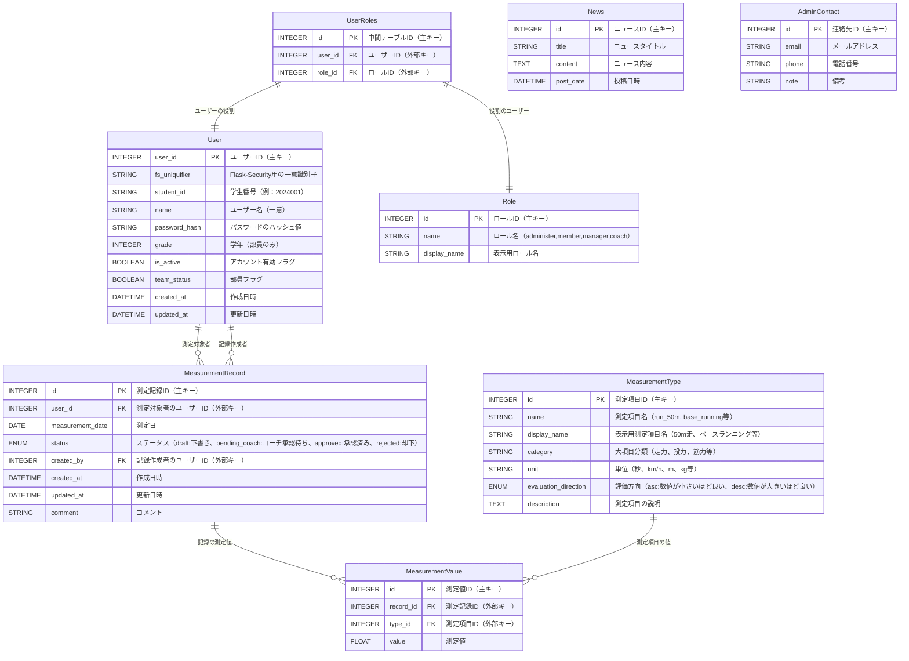

```mermaid
erDiagram
  %% ユーザー管理テーブル
  User {
    INTEGER user_id PK "ユーザーID（主キー）"
    STRING fs_uniquifier "Flask-Security用の一意識別子"
    STRING student_id "学生番号（例：2024001）"
    STRING name "ユーザー名（一意）"
    STRING password_hash "パスワードのハッシュ値"
    INTEGER grade "学年（部員のみ）"
    BOOLEAN is_active "アカウント有効フラグ"
    BOOLEAN team_status "部員フラグ"
    DATETIME created_at "作成日時"
    DATETIME updated_at "更新日時"
  }
  
  %% ロール管理テーブル
  Role {
    INTEGER id PK "ロールID（主キー）"
    STRING name "ロール名（administer,member,manager,coach）"
    STRING display_name "表示用ロール名"
  }
  
  %% ユーザーロールの中間テーブル（多対多）
  UserRoles {
    INTEGER id PK "中間テーブルID（主キー）"
    INTEGER user_id FK "ユーザーID（外部キー）"
    INTEGER role_id FK "ロールID（外部キー）"
  }
  
  %% 測定項目管理テーブル
  MeasurementType {
    INTEGER id PK "測定項目ID（主キー）"
    STRING name "測定項目名（run_50m, base_running等）"
    STRING display_name "表示用測定項目名（50m走、ベースランニング等）"
    STRING category "大項目分類（走力、投力、筋力等）"
    STRING unit "単位（秒、km/h、m、kg等）"
    ENUM evaluation_direction "評価方向（asc:数値が小さいほど良い、desc:数値が大きいほど良い）"
    TEXT description "測定項目の説明"
  }
  
  %% 測定記録テーブル
  MeasurementRecord {
    INTEGER id PK "測定記録ID（主キー）"
    INTEGER user_id FK "測定対象者のユーザーID（外部キー）"
    DATE measurement_date "測定日"
    ENUM status "ステータス（draft:下書き、pending_coach:コーチ承認待ち、approved:承認済み、rejected:却下）"
    INTEGER created_by FK "記録作成者のユーザーID（外部キー）"
    DATETIME created_at "作成日時"
    DATETIME updated_at "更新日時"
    STRING comment "コメント"
  }
  
  %% 測定値テーブル
  MeasurementValue {
    INTEGER id PK "測定値ID（主キー）"
    INTEGER record_id FK "測定記録ID（外部キー）"
    INTEGER type_id FK "測定項目ID（外部キー）"
    FLOAT value "測定値"
  }
  
  %% ニュース管理テーブル
  News {
    INTEGER id PK "ニュースID（主キー）"
    STRING title "ニュースタイトル"
    TEXT content "ニュース内容"
    DATETIME post_date "投稿日時"
  }
  
  %% 管理者連絡先テーブル
  AdminContact {
    INTEGER id PK "連絡先ID（主キー）"
    STRING email "メールアドレス"
    STRING phone "電話番号"
    STRING note "備考"
  }
  
  %% リレーションシップ
  UserRoles ||--|| User : "ユーザーの役割"
  UserRoles ||--|| Role : "役割のユーザー"
  User ||--o{ MeasurementRecord : "測定対象者"
  User ||--o{ MeasurementRecord : "記録作成者"
  MeasurementRecord ||--o{ MeasurementValue : "記録の測定値"
  MeasurementType ||--o{ MeasurementValue : "測定項目の値"
```