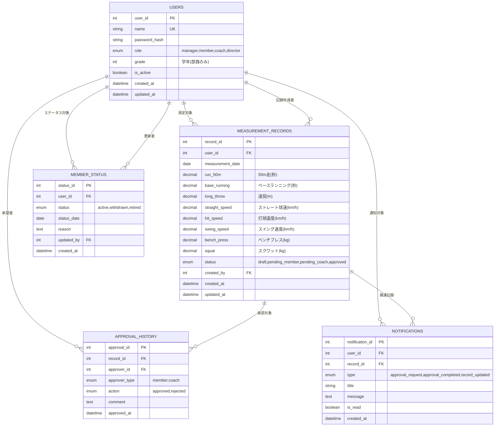

    <!-- %% システム設定（測定項目管理）
    MEASUREMENT_ITEMS {
        int item_id PK
        string category "走力,肩力,打力,筋力"
        string item_name
        string unit
        boolean is_active
        int display_order
    } -->
